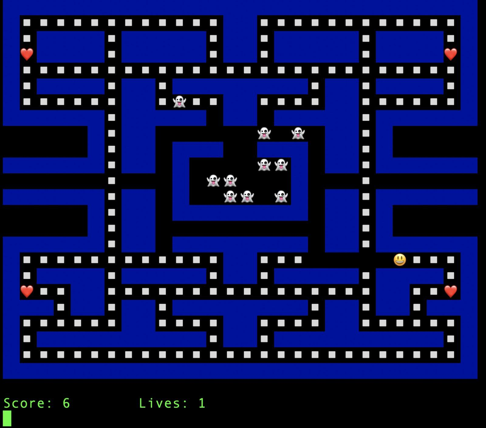

# Pac Go

A Pac Man clone written in Go (with emojis!)



## Introduction

Welcome to Pac Go! This project is a tutorial to introduce people to the [Go programming language](https://golang.org).

### Why a new tutorial?

We have a lot of great tutorials out there, but the whole idea about this tutorial is to make something different and fun while learning Go. Yes, we need to know about APIs and CRUDs on a daily basis, but while tackling something new, why not making a game instead?

Go is one of the languages that is known for making programming fun again, and what could be more fun than writing a game? Interested? Great, let's move on!

We will be writing a Pac Man clone for the terminal. While writing a game you are exposed to several interesting requirements that make a very good ground for exploring many features of the language, including input, output, functions, pointers, concurrency and a bit of math.

You also learn a bit more about the terminal and its magical escape sequences.

### Conference Talks

If you want to have a look at the tutorial in a talk format before trying (about 25 minutes), try one of the links below:

1. [Google Cloud Next UK '19](https://cloud.withgoogle.com/next/uk/sessions?session=DZ224), London, UK (November, 21st 2019)
1. [London Gophers](https://youtu.be/SM8LTMnB4x0), London, UK
1. [GoWayFest 3.0](https://youtu.be/0qvW4kIlS8I), Minsk, Belarus
1. [GothamGo 2019](https://youtu.be/GH0DlCKTppE), New York City, NY, USA

### Contributing

This project is open source under the MIT license, which means you are basically free to do whatever you want with it, just give me the proper credits. :)

If you want to contribute just raise an issue and/or submit a pull request.

If you are looking for inspiration you may browse the open issues or have a look at the [TODO](TODO.md) list. 

Everything on the TODO list should be planned as a new step on the tutorial unless otherwise noted.

### License

See [LICENSE](LICENSE).

### Contacting the Author

If you have any questions, please reach out to me at [daniela.petruzalek@gmail.com](mailto:daniela.petruzalek@gmail.com). I'm also on Twitter as [@danicat83](https://twitter.com/danicat83).

## Getting Started

### Pre-requisites

It's recommended to have:
- Basic understanding on how programming languages work, as we won't be covering the basics
- Basic terminal knowledge (know how to use command line applications)

Of course, if you don't have the above, but is a curious spirit and want to try anyway, please feel free to do so.

### Compatibility Warning!!!

This tutorial has been tested on both **Linux** and **Mac OS X** environments. For Windows environments you _may_ need to install a terminal emulator, like [Git BASH](https://gitforwindows.org/).

Please beware that since this code relies on the terminal to render the game it can produce different results for different configurations.

If you have an issue feel free to raise it so we can find a proper solution, naming both your OS and terminal names and versions.

**Note:** It is a known issue that the terminal window on VS Code doesn't render the game correctly at this moment.


### Setup

In order to start, make sure you have Go installed in your system.

If you don't, please follow the instructions in [golang.org](https://golang.org)

### How to use this tutorial

In every step, including step 0 (this one), we will describe the task in the README.md file followed by the code that does it and an explanation of how it works.

Every step is located in its separate folder except for this one. Look for the folders stepXX for any given step.

We will be editing a file called `main.go`. All the code in this tutorial will reside in this file. A proper program would usually have multiple source code files, but for the sake of simplicity we are keeping this program limited to one source.

The README.md for each step will explain the intent and show the modifications needed to proceed. You should make them in your own `main.go` file.

You can also use the `main.go` in step 00 as a starting point and modify it incrementally when progressing through the steps.

If you get lost, every step has its own `main.go` file with the changes to that step already applied. That also means that if you want to fast track to a given step you can start with the `main.go` from the previous step.

## Step 00: Hello (Game) World

We are going to start by laying the ground a skeleton of what a game program looks like.

Pick a directory to be your work dir (e.g., `tutorial` under your home folder) and create a file called `main.go` with the content below.

Note: Alternatively you can just clone this repository and edit the `main.go` file on its root.

```go
package main

import "fmt"

func main() {
    // initialize game

    // load resources

    // game loop
    for {
        // update screen

        // process input

        // process movement

        // process collisions

        // check game over

        // Temp: break infinite loop
        fmt.Println("Hello, Pac Go!")
        break

        // repeat
    }
}
```

### Running your first Go program

Now that we have a `main.go` file (`.go` is the file extension for Go source code), you can run it by using the command line tool `go`. Just type:

```sh
$ go run main.go
Hello, Pac Go!
```

That's how we run a single file in Go. You can also build it as an executable program with the command `go build`. If you run `go build` it will compile the files in the current directory in a binary with the name of the directory. Then you can run it as a regular program, for example:

```sh
$ go build
$ ./pacgo
Hello, Pac Go!
```

For the purposes of this tutorial we are using only a single file of code (`main.go`), so you may use either `go build` and run the command or just `go run main.go` as it does both automatically.

### Understanding the program

Now let's have a close look of what the program does.

First line is the `package` name. Every valid Go program must have one of these. Also, if you want to make a **runnable** program you must have a package called `main` and a `main` function, which will be the entry point of the program.

We are creating an executable program so we are using `package main` on the top of the file.

Next are the `import` statements. You use those to make code in other packages accessible to your program.

Finally the `main` function. You define function in Go with the keyword `func` followed by its name, its parameters in between a pair of parentheses, followed by the return value and finally the function body, which is contained in a pair of curly brackets `{}`. For example:

```go
func main() {
    // I'm a function body
}
```

This is a function called `main` which takes no parameters and returns nothing. That's the proper definition of a main function in Go, as opposed to the definitions in other languages where the main function may take the command line arguments and/or return an integer value.

We have different ways to deal with the command line arguments and return values in Go, which we will see in [Step 08](step08/README.md).

In the game main function we have some comments (any text after `//` is a comment) that are acting as placeholders for the actual game code. We'll use those to drive each modification in an orderly way.

The most important concept in a game is what is called the game loop. That's basically an infinite loop where all the game mechanics are processed.

A loop in Go is defined with the keyword `for`. The `for` loop can have an initializer, a condition and a post processing step, but all of those are optional. If you omit all you have a loop that never ends:

```go
for {
    // I never end
}
```

We can exit an infinite loop with a `break` statement. We are using it in the sample code to end the infinite loop after printing "Hello, Pac Go!" with the `Println` function from the `fmt` package (comments omitted for brevity):

```go
func main() {
    for {
        fmt.Println("Hello, Pac Go!")
        break
    }
}
```

Of course, in this case the infinite loop with a non-conditional break is pointless, but it will make sense in the next steps!

Congratulations, step 00 is complete!

[Take me to step 01!](step01/README.md)
